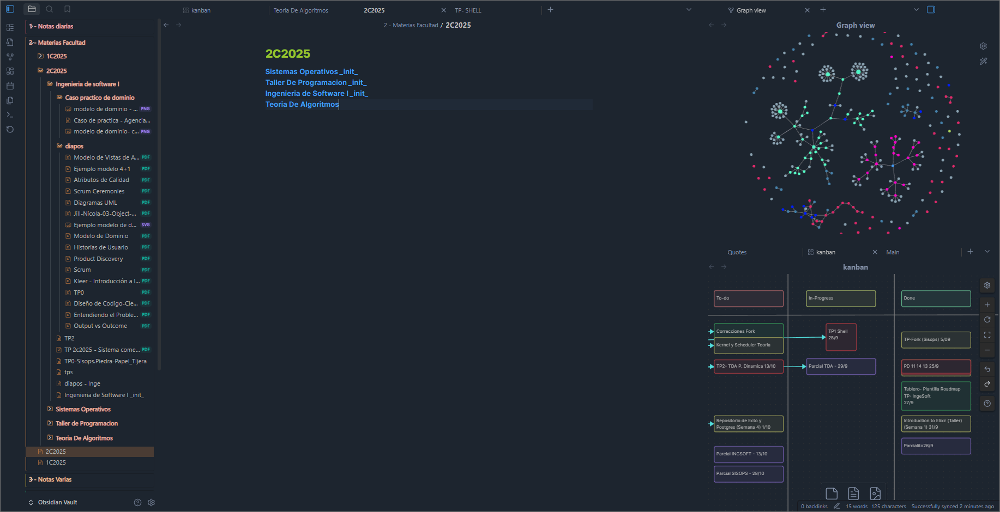

# Personal Obsidian Configuration
## Overview
My personal Obsidian setup to manage University, Projects and Personal Documentation. 


## Description

These are the plugins and configurations that I use to have a dashboard every time I open Obsidian, to keep track of tasks and goals in a organiced and centraliced way.
The most relevant plugins that I incorpore are:
- [Remotely-save](https://github.com/remotely-save/remotely-save): with a web-dav link, I keep the information and documents constantly being backuped in a remote storage, so I can have this data over multiple devices
- [Obsidian-better-command-palette](https://github.com/AlexBieg/obsidian-better-command-palette): So I can have more functions with ```Ctrl+Shifp+P```
- [Obsidian-minimal-settings](https://github.com/kepano/obsidian-minimal-settings): To keep the minimal theme settings simple

## Usage
1. Inside a Folder of Documents create a _.obsidian_ folder and make a ```git clone``` inside that directory

2. Create a ```new Vault``` in Obsidian using the container of that folder.

The output could be tricky because of the workspace.json file because of the layout info that it contains, some of it to the names of the files in my personal Vault. But after that, everithung is setup